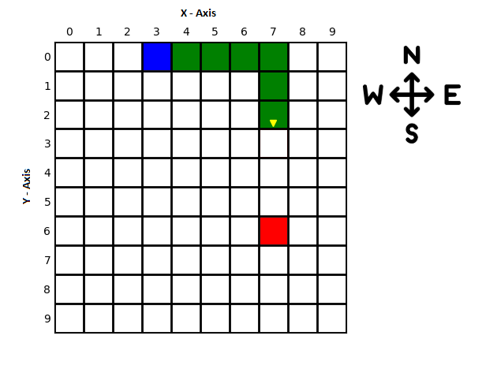
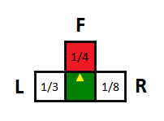
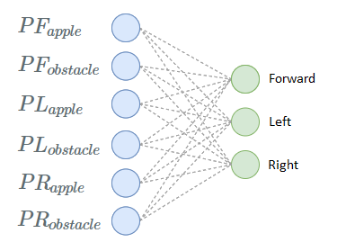
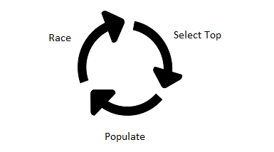
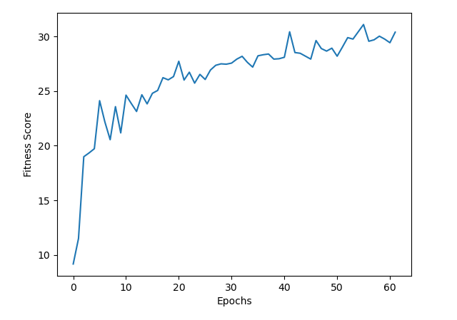

## Motivation
You've probably heard of computer programs surpassing best human players on various games. 
Handcrafted algorithms for those games have been around for a long time, but how about just telling the rules to
the computer and let it play all by itself to master a game? This is rather something new. It's very exciting to 
witness a program going from zero to hero by gaining experience, just like a baby growing up :)

As an AI practice, I wanted to get my hands dirty on this particular subject and thought that good old snake 
game would be a great match for the task. It's neither too simple like *Tic-Tac-Toe*, nor too complex like *Chess*, 
in between somewhere.

## The Game 
A baby snake comes into existence between walls and its goal is to eat as much apple as it can. While looking for an
apple, if it hits the wall or try to take a bite from its own body, it dies. If it eats an apple, it grows. An apple 
can appear only at one place at a time and stays there until it is eaten. New apples will appear randomly in free space 
as they're eaten.

## Key Design Considerations
There may be multiple solution approaches to this game. In order to simplify deciding on a solution, I'll follow some
basic principles and draw the borders:
<br/>
<br/>
- **Effective Simplicity**: Model should be as simple as possible, but also show signs of intelligence.
- **Decent Performance**: Model should get better over time and converge towards theoretical limit.
- **Computation Feasibility**: Necessary computations should be feasible to an average computer.

## Environment Model
Snake senses its surrounding environment and decides what to do next. We need a model to represent environment so that 
snake can take action corresponding to its *sensory inputs*.
<br/>
<br/>
- **Game State**
    - **Board size**: Side length of the board to form a 2D coordinate system. We'll assume this value as `10` unless explicitly mentioned otherwise.
    - **Snake body parts**: Array of coordinates ordered by tail to head, $$[(x_1,y_1),(x_2,y_2), \ldots ,(x_n,y_n)]$$.<br/> Notice `n` here would be the size of the snake.
    - **Snake head direction**: Could be one of four directions: `NORTH` , `EAST` , `SOUTH` or `WEST`
    - **Apple position**: Coordinate of the apple, $$(x_a,y_a)$$
<br/>
<br/>


#### Sample Game State


{: .center}

Model for this state would be:

```python
board_size = 10
snake_body = [(3,0),(4,0),(5,0),(6,0),(7,0),(7,1),(7,2)] # tail first, head last
head_direction = DIRECTIONS.SOUTH
apple = (7,6)
```
Notice how `X` and `Y` axis values change over `DIRECTIONS`. `Y` values gets *bigger* as going to `SOUTH`, which runs counter to common notation in math.

## Snake Sensory System
Snake will have its own *limited* view of the game state. We could have provided *full state* but we just want to keep things simple for now. Here is snakes vision for the [sample state](#sample-game-state) mentioned above:


{: .center}

**L**,**F** and **R** are `TURN_DIRECTIONS` <small>(Left, Forward and Right)</small> **relative** to snake head. The *fractions* inside each box are called **proximity measures**.
Proximity measure ($$P$$) denotes how close snake head and **first seen** object on its sight are. An object could be a wall, a part of snake body or an apple. F box is red here because there is an apple in sight, L and R are not colored means that there is either wall or body is in sight.

Proximity measure ($$P$$) is defined as $$1/d$$ where $$d$$ is `1 + count(empty squares between head and object)` and it is calculated for each `TURN_DIRECTION` (L,F,R). 

Following table shows proximity measures for the image above. Note that, for a single direction of sight, apple and obstacle proximities are mutually exclusive, first encountered objects proximity is valid and the other one is set to zero by definition.
<p></p>

&nbsp;|Left Sight|Forward Sight|Right Sight
$$d$$<small>*(distance to object)*</small>|3|4|8
**Apple Proximity**|0|**1/4**|0
**Obstacle Proximity**|**1/3**|0|**1/8**

**Sensory inputs** are defined as stacking directional proximities in F,L,R order: 

<div class="scroll-overflow-x">
$${[PF_{apple} , PF_{obstacle},PL_{apple}, PL_{obstacle},PR_{apple} , PR_{obstacle}]}$$
</div>
For our sample, sensory inputs are: 

```python 
[0.25, 0, 0, 0.333, 0 , 0.125]
```

## The Brain

{: .center}

> Brains are the only things worth having in this world, no matter whether one is a crow or a man.
> <div class="quote-author"> L. Frank Baum, "The Wonderful Wizard of Oz"</div>

We got our model and sensory inputs defined, now it is time to have a brain for processing inputs. The function we need will take
**sensory inputs** and give us next action to take, which is either `turn left`, `turn right` or `keep going forward`.

It feels like neural networks would be perfect for this job. 6 dimensional input ranging `[0,1]` and 3 dimensional output ranging `[0,1]`.
Let's build a ridiculously simple network that even doesn't have a hidden layer. Actually, it's just a [Softmax Regression](http://ufldl.stanford.edu/tutorial/supervised/SoftmaxRegression/) model.


{: .center}

Network is fed with sensory inputs as shown in above image and 3 output values are calculated, we choose the maximum activated neuron and make the corresponding turn.
If first output neuron value is the highest, then we keep going forward, if it's second, we take a left.

Gray dashed lines are connections between neurons of successive layers. Each connection has its own **weight** and transmits weighted signal from its input to the output.
There are `6x3=18` connections between neurons. In addition, we have 3 more terms for output layer which are called as **bias**. So we have a total of `18+3=21` adjustable parameters for the network. <small>*Note that, for the rest of the article, I will use the term "weights" to reference both weights and biases of a neural network.*</small>

**All we need to do is to find a good combination among all possible 21 number combinations**. A good combination is a set of network parameters that drives snake to collect the apples without hitting obstacles, as far as it can get.

## Finding Magic Numbers

How are we going to find the *magic numbers*? I tried picking random values over and over until I accepted the fact that I have no luck, snake was dying in a blink of an eye.

What if we train the network with previously played games? Sounds like a good idea but I don't want to go under the load of finding/creating a labeled gameplay set. Besides, it would have been supervised. For now, I just want to see how far it can go unsupervised, nevertheless I'll give this idea a try at a later time. 

How about starting with random numbers, change them a little bit and see if it leads to a better result? If the change affected the snake in a positive way, we might think that the *new number set* is **closer** to the *magic numbers*, in respect to *the set we started with*.

These are the ideas I can think of for finding an efficient set in 21-dimensional space, so I've chosen the last idea for hypothesis. 

## Evolution

> The apple doesn't fall far from the tree.

Change in network models weights results in having a new network model. We can keep applying changes over new networks and have a very different network eventually. 
This process looks like the evolution of genes in biology, where you observe diversity of species and behaviours. Similarly, change in weights effects snakes behaviour. 

Following this intuition, weights can be considered as genes of an individual. Genes can change via mutation, so can weights. Full set of weights can be seen as chromosome of snake.

Snakes genetic material is 1 chromosome which consists of 21 genes. A sample chromosome could look like: 
<p></p>
```python
chromosome = [-0.75339303, -0.12927185,  0.25323512, -0.92801051,  0.18548144, 0.92465972, -0.66239453,  0.22117634,  0.02097157,  0.46934737,
  0.0514949 , -0.08590836,  0.45087893, -0.5963971 ,  0.35278758, -0.30294179,  0.30369261, -0.72939709,  0.94643573, -0.84969819, -0.44188375]
```

So, how exactly are we going to change the chromosomes? Here are some quick options:
<p></p>
- Update fixed number of randomly selected genes with random values.
- Pick two snakes, select each gene from either snake 1 or snake 2, randomly.
- Update all genes with random values.

Again by intuition, I'll go with option 3, because it's pretty straightforward.

Let's define our **mutate** function:

$$mutate(c_n,\alpha) = c_n + \Delta_n(\alpha) = c'_n $$

where $$c_n$$ is chromosome with $$n$$ genes, $$\alpha > 0$$ is *mutation rate* and $$\Delta_n(\alpha)$$ is $$n$$-dimensional vector of random values in range $$[-\alpha,\alpha]$$

According to definition, sample values could be:
<p></p>

$$n$$ |   `21`     |           
$$\alpha$$ |   `0.5`     |           
$$\Delta_n(\alpha)$$ | `[ 0.15, -0.23, -0.12, -0.43, -0.49,  0.05,  0.3 , -0.06,  0.04, 0.43,  0.41,  0.47, -0.26,  0.21,  0.24, -0.2 ,  0.05, -0.03, -0.34, -0.11, -0.3 ]` |       
$$c_n$$ |   `[-0.76,  0.33,  0.7 ,  0.25, -0.08,  0.48,  0.95,  0.55,  0.98, 0.32, -0.75,  0.24, -0.57, -0.76, -0.21, -0.89,  0.73,  0.02, 0.94,  0.44, -0.74]`     |           
$$c'_n$$ |   `[-0.61,  0.1 ,  0.58, -0.18, -0.57,  0.53,  1.25,  0.49,  1.02, 0.75, -0.34,  0.71, -0.83, -0.55,  0.03, -1.09,  0.78, -0.01, 0.6 ,  0.33, -1.04]`     |           

## Population Management

Let's say we initiated a pool of 1000 randomly generated snakes, we can test their performance and rank them from best to worst. The intuition is, top performers have genes that 
fits environment better than bottom ones. We want to apply mutation and search for even better snakes. We can choose to mutate all snakes in pool and double the population, but soon 
this will exceed our computational capacity. One way to handle this situation is to regulate population by some kind of policy.

### Survivor Selection

We have to drop out some of the snakes, keeping only top $$t$$ performers seems simple enough. After downsizing pool, we have some open space for new generation snakes.
We can repopulate the pool by taking $$t$$ survivors as base and mutate each multiple times until pool is full again. Once pool is full, we will rank the snakes again and keep 
applying this process as a cycle.


{: .center}

Hopefully, running this process repeatedly will lead to a population of decently behaving snakes.

### Ranking Individuals

What makes a snake superior to other? It's ability to collect more apples without dying. We need a measure of how good this ability is, let's call it **fitness score**, this value should be highly correlated with the size of the snake (or eaten apple count). More parameters could be introduced to calculate a fine tuned fitness, like, total number of moves, left turn count, right turn count or even more complex ones. Since these extra parameters need to be engineered to take place in the formula, we'll only take snake size into account for now.

$$ f_{snake} = length(snake)$$


## Wiring Up 

We have mentioned fundamental aspects of the problem more or less. There are still some points we haven't covered so it is worth to remark about them briefly. 

First generation snakes requires random chromosome initialization. There are several types of random distributions, I preferred *random uniform distribution* between [-1,1] for this. Similarly, mutations ($$\Delta_n(\alpha)$$) will be drawn from random uniform distribution. These choices are empirical and there is always room for better alternatives which I haven't tried yet.

When we rank individuals in pool, it is better to calculate an average score over multiple games per individual because playing only one game could be misleading for judging the performance. Maybe that was a stupid snake who goes forward all the time but too lucky apples were laid out all on its way. This will result in giving good score to bad behaviour. The more game played per individual, the more reliable the score is. 

Fitness score doesn't have to depend on size of the snake only. You can see in the code details that I included a bias term which penalize snake if it always choose to turn same direction.

A quick recap of full sample model before we see it in action.
<p></p>

 | | Value | Description <span class="horizontal-spacer"><span>
*Board Size* | 10 | <small>10 x 10 coordinate system that snake will move inside.</small>
*Max Move Count* | 100 | <small>The number of consecutive moves without eating apple. This is used to end the game if snake stucks in a loop.</small>
*Pool Size* | 100 | <small>Maximum number of individual snakes that can exist in the pool.</small>
*Top Performers Count* | 10 | <small>Number of individuals to be kept in pool after ranking take place.</small>
*Network Structure* | 6x3 | <small>Fully connected neural network.</small>
*$$n$$* | 21 | <small>Number of parameters of neural network structure (brain).</small>
$$\alpha$$ | 0.5 | <small>Mutation rate. Maximum possible magnitude of change in a gene for single mutation operation.</small>
$$c_n$$ `(n=21)` | `[w1,w2,..,w21]` | <small>Chromosome of one snake. First generation snake chromosome values are initialized randomly.</small>
$$\Delta_n(\alpha)$$ `(n=21)` | `[d1,d2,..,d21]` | <small>Sequence of mutations for a chromosome. Values are drawn from random distribution.</small>
*Game per Snake* | 5 | <small>Specifies the number of games will be run in order to calculate average fitness score for snake.</small>
*Fitness Score Calculation* | length(snake) | <small>A measure of snakes success in game. Can depend more paramaters than length of snake too.</small>

---

## Code

Code can be seen at [https://github.com/cankut/snake](https://github.com/cankut/snake-ai). It's implemented in Python.

## Results & Analysis

- Initialized pool with 1000 snakes.
- Ranked individuals over averaging 30 gameplays score.
- Took top 10 and repopulated pool to 100 ($$\alpha=0.5$$).
- Repeated selection process 60 times (60 epochs).


{: .center}

Above image shows #1 snakes fitness score of each epoch (single cycle of ranking and repopulating). Top snake achieves a start score of ~9 and quickly raises up to ~20 and then slowly climbs up to ~30. Chromosome value range of the top snake has *extended*, remember we started within [-1,1] range and now we end up with this sequence: 

`[ 1.8177, 1.6102, -1.4134, 0.6585, 3.6294, 0.4303, -3.3272, 1.7338, 3.3607, -0.2571, -1.9135, 1.3314, -3.4971, -3.5743, 1.6051, 3.4078, 3.3139, -0.2936, 0.5557, -0.949, 0.7132]`

:bulb: *This may be the reason behind diminishing performance gain over epochs. Since $$\alpha=0.5$$ has a lighter effect on bigger magnitudes, it can take more time to get to a better point. We can try increasing $$\alpha$$ and see if it helps.*

We run 60 epochs but not every epoch led to new generations show up in top 10. This is because new generation snakes are not always performing better than their ancestors, so in some epochs, new snakes can't rank in top 10 and we continue with old-generations. As a result, we have 25 generations in response to 60 epochs.


## Questions

- Can we achieve significantly better results with **same** sensory inputs? Do you think changing following settings would help?
  - Network Structure
  - Fitness score calculation
  - Chromosome initialization and $$\Delta$$ calculation (different random distributions)
  - Dynamic $$\alpha$$ values, changing over epochs
  - New survivor selection procedure
- Can we handcraft chromosome values to create a better snake?
- Can a human perform better with given same limited sensory inputs as snakes?
- Parameters we choose has been driven by intuition and trial/error, can we formalize our selection of parameters ?
- Can we do better with **more** sensory inputs, how?

## Playground

You can choose one of the top 10 snakes and see it in action.

<p>
<span>Snake # </span> 
<select id="snake">
<option value="0" >1</option>
<option value="1" >2</option>
<option value="2" >3</option>
<option value="3" >4</option>
<option value="4" >5</option>
<option value="5" >6</option>
<option value="6" >7</option>
<option value="7" >8</option>
<option value="8" >9</option>
<option value="9" >10</option>
</select> 
<br/>
<span>Timeout between moves (ms) </span> 
<select id="timeout">
<option value="20" >20</option>
<option value="50" >50</option>
<option value="100" selected >100</option>
<option value="200" >200</option>
<option value="500" >500</option>
</select>
<button id="btnPlay" >Run</button>
<p></p>
<canvas id="playboard" width="422" height="422"></canvas>
<span id="score">Snake Size:<span id="snakesize"></span></span>
</p>

### Human with Snake Vision

Can you do better than the artificial snake? Give it a try with the vision of snake. Hit cells around green square (head) to move the snake towards desired direction.
A replay of the game will appear after snake dies, you can hit any cell to restart the replay.

<button id="btnReset" >Reset</button>
<p></p>
<table id="snakevision">
<tr>
<td class="noborder"></td>
<td class="command" data-value="0"><!-- FORWARD --></td>
<td class="noborder"></td>
</tr>
<tr>
<td class="command" data-value="1"><!-- LEFT --></td>
<td class="body"></td>
<td class="command" data-value="2"><!-- RIGHT --></td>
</tr>
</table>
<span id="userscore">Snake Size:<span id="usersnakesize"></span><span id="gameover"></span></span>

<div id="replay_container">
<canvas id="replay" width="422" height="422"></canvas>
</div>