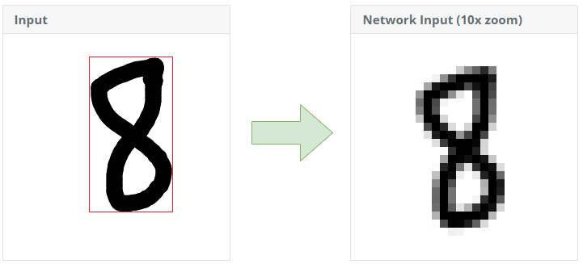

  Loading Neural Network Models...
  

    

      
    

  

## Handwritten Digit Recognition with JavaScript
Two seperate neural networks are pre-trained with MNIST dataset using Keras on top of Tensorflow. Forward-Pass logics of both networks are implemented in JavaScript and executes in browser. Draw a digit in the input area and click "recognize" button to see the results.

**Preprocessing Options**   

  

|-----------|-------------------------|
| Centering | <select id="centerby"><option value="mass" selected>mass</option><option value="boundingbox">boundingbox</option></select> |
| Fit to Scale (px) | <select id="scalesize"><option value="150">150</option><option value="200" selected>200</option><option value="250">250</option></select> |
| Smoothing | <select id="smooth"><option value="true" selected>true</option><option value="false" >false</option></select> |
| Downsizing | <select id="downsizing"><option value="canvas">canvas</option><option value="binning" selected>binning</option></select> |

  

      
Input

      

        <canvas id="input" width="280" height="280"></canvas>
      

      

        <input id="clear" type="button" value="Clear" />
        <input id="recognize" type="button" value="Recognize" />
      

  

  

  

      
Preprocessing

      

        <canvas id="preprocess" width="280" height="280"></canvas>
      

      
&nbsp;

  

  

      
Network Input (10x zoom)

      

        <canvas id="zoom" width="280" height="280"></canvas>
      

      
&nbsp;

  

<table>
<tr style="font-weight: bold">
    <td style="text-align: center">Network Input</td>
    <td>Model</td>
    <td>Prediction</td>
</tr>
<tr>
    <td style="text-align: center" rowspan="2"><canvas id="actual" width="28" height="28"></canvas></td>
    <td>Deep FF Neural Network </td>
    <td>1</td>
</tr>
<tr>
    <td>Convolutional Neural Network</td>
    <td>2</td>
</tr>
</table>

## Network Architectures

- **Deep Feed Forward Neural Network**
  - Input Layer (28x28 = 784 Neurons) 
  - Hidden Layer (128 Neurons, ReLU as Activation)
  - Output Layer (10 Neurons, Softmax as Activation)

 

- **Convolutional Neural Network**
  - Input Layer (28x28 Neurons) 
  - Convolutional Layer (32 kernels size of (3x3), ReLU as Activation)
  - Convolutional Layer (64 kernels size of (3x3), ReLU as Activation)
  - Pooling Layer (MaxPooling pool size of (2x2))
  - Flatten Layer (64x12x12 = 9216 Neurons)
  - Hidden Layer (128 Neurons, ReLU as Activation)
  - Output Layer (10 Neurons, Softmax as Activation)

## Preprocessing

In MNIST dataset, samples are normalized as author described [here](http://yann.lecun.com/exdb/mnist/).

> The original black and white (bilevel) images from NIST were size normalized to fit in a 20x20 pixel box while preserving their aspect ratio. The resulting images contain grey levels as a result of the anti-aliasing technique used by the normalization algorithm. the images were centered in a 28x28 image by computing the center of mass of the pixels, and translating the image so as to position this point at the center of the 28x28 field.

To have similar inputs as MNIST dataset, you can adjust normalization by changing preprocessing options. Input images bounding box is calculated and following options are available for preprocessing of the bounding box image.

{: .center}

- **Centering**: Positions image at the center the of canvas. Can be center-of-mass or bounding rectangles center.
- **Fit to Scale**: Fits bounding box image to given scale preserving aspect ratio. 
- **Smoothing**: Switches [imageSmoothingEnabled](https://developer.mozilla.org/en-US/docs/Web/API/CanvasRenderingContext2D/imageSmoothingEnabled) property of Canvas API used in scaling operations.
- **Downsizing**: Method to downsize 280x280 image to 28x28. Can be Canvas API scaling or pixel binning.

## Code

Feedforward implementation for both networks can be seen [here](https://github.com/cankut/cankut.github.io/tree/master/js/digitrecognition/).

- **Activation.js** defines activation functions (ReLu, sigmoid, softmax) to be used in neural networks forward propagation.
- **Matrix.js** defines matrix operations such as multiplication, sum and convolution operations.
- **NeuralNetwork.js** defines types of network layers (dense, conv2d, flatten, etc.) and implements forward propagation.
- **main.js** handles preprocessing of input and canvas drawing events.
- **model files** pre-traind model files (network layer definitions & weights) are stored as JSON formatted.