## References

This overdue blogpost is based on the ideas from paper [*Prime Portraits*](http://archive.bridgesmathart.org/2016/bridges2016-359.pdf)

Also check out Roland Meertens' great work on same subject [here](http://www.pinchofintelligence.com/painting-by-prime-number/).

## Prime Images

Consider the following images below, they have somethings in common.
<p></p>
<div class="img-container" style="height: 250px;overflow-x: auto;overflow-y: hidden;">
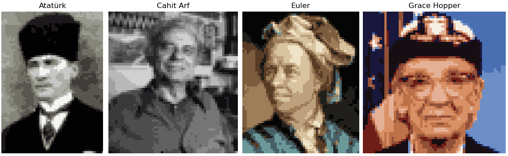 
</div>

Aside from each being a great mind and being low-color/resolution, they share an inconspicuous truth behind their pixels. 
Starting from the top-left corner of the image, when you put color values of each pixel side by side, you obtain a large number. And this number is a **prime**! 

It is a funny idea that, for given any scene, there exists a prime number conjugate.

## Image Representation

As you have noticed, the prime images are very low-color, this is because each pixel is represented by a decimal digit (0..9) and there can only be 10 different colors.

Here is a sample prime image, each pixel annotated with its respective color index from the palette:

<div class="img-container" style="overflow: auto">
    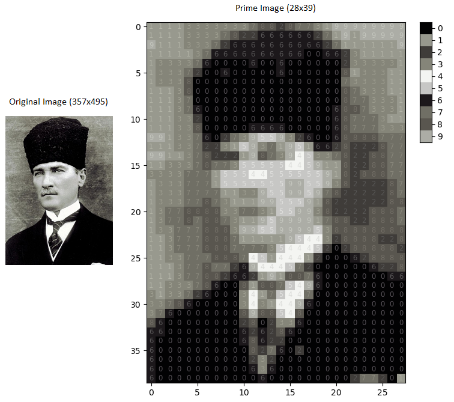 
</div>

Original images 6,783 dimensional color-space is reduced to a 10 dimensional color-space, then the original image is downscaled to a 28x39 image painted with 10-colored-palette. Prime image is composed of 28x39=1,092 pixels which corresponds to a 1,092-digit prime number *(1111333......277201)*. Each digit in the number is an 
index pointing to the color-palette. For the sample above, 0 and 6 points dark colors (black) whereas 4 points the lightest one (white).

<p></p>

```python
# Prime number gives Atatürk's portait when arranged in 28x39 pixels.
111133333337882877319999999911113333782266666627191999999111333726666666666271111119111113766666666660066231111113333760000600600000023333311333720060000060000008133311133380000000000000000733331111138000000000000000087333111113700000000000000008773331111376000000000000006887333111133200000000000000687773111113380000066660000068777333991337602739559326006888877711133722315937195166282228779911378222198739453378228877113337877355555445911822887733337771555445555559182888771333777155555559955938222287133377771133955995978222228713337787311199555918222222881377888833773155993822228887137787887311959999178822888713377788839955999953888888881137778887111119544328888228113777888777735444520288888211337778887451444120006288881113778772694445720000006228111377882662191887600000006611333786008188754960000000003133726000341754470000000000337860000034314496000000000037600000008988548000000000008600000000280233600000000000660000000062628600000000000060000000006862200000000000006000000000082760200000000000600000000002320000000000000060000000000636000000000000006000000000006000000000277201
```

## Color Space Reduction

We need to reduce original images high dimension color-space into a 10 dimension color-space. This can be done by grouping similar colors together and assigning each group an average color representing the members of the group.

A color is composed of 3 values: Red, Green, Blue. We can think of a color as a 3-D coordinate in space, close points in space are similar in terms of color and far points are different. Note that different [models](https://en.wikipedia.org/wiki/Color_model) could be used to represent a color other than RGB, like HSL, HSV etc.

The plot below shows the distribution of a sample images colors in 3-D space. Dense regions are easily detectable by naked eye. *(the colorful image is chosen intentionally to illustrate the effect of condensening points.)*

<div class="img-container" style="overflow: auto; padding-top: 4px">
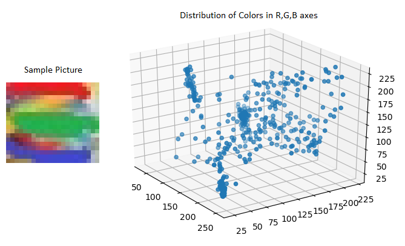 
</div>

Even if dense regions are not obvious to the naked eye, there are some mathematical ways of grouping close points. One of them is [K-Means Clustering](http://a.io) which 
finds K centroid points for given dataset, where K is the total number of groups you want to create. For our example, K = 10.

## Downscaling

Back to Atatürk's original portrait image, it has a size of 357x495 and if I tried to fit a ‭176,715‬ digits long prime, it would not be practicle for my computer.
Instead, we can work on a downsized version of the original image. Up to ~3,600 digits are feasible to compute so I've chosen 28x39 = 1,092 which gives fast results and relatively clear images that preserves the essence of the original one.

Downsized image still has too much colors to be represented as a prime so we repaint the image with colors obtained from previous (K-Means clustering) step. At the
end we have smaller image which consists of only 10 colors and *most likely*, the resulting number is *not* a prime. This number will be the *seed* for our search for the prime image.

## Probability of a Prime

According to [Prime Number Theorem](https://en.wikipedia.org/wiki/Prime_number_theorem), the count of prime numbers not bigger than $$N$$ is stated as
$$\pi\small(N)\normalsize \sim \frac{N}{log(N)}$$. The probability of a randomly chosen n-digit number being prime is:

$$\small P_n = \frac{count \ of \ n \ digit \ primes}{count \ of \ n \ digit \ numbers}$$

count of n digit primes = $$\pi\small(10^{n})\normalsize - \pi\small(10^{n-1})$$

count of n digit numbers = $$9\times10^{n-1}$$

$$\small P_n = \frac{\pi\small(10^{n})\normalsize - \pi\small(10^{n-1}\normalsize)}{9\times10^{n-1}}$$

For instance, a randomly picked 1000-digit number has **0.043%** (4.3 in 10,000) chance of being a prime.

## Search Technique

Remember the downscaled image which had 1092 pixels, and its corresponding number most likely not a prime. We will use this number as a **seed** for searching through prime candidates. Our goal is to find a prime number differing from the *seed* number only in few digits. In this manner, seed image and prime image would be indistinguishable to the naked eye.

We will randomly change some predefined amount of the digits of the seed number and check if the new number is a prime. It is better to keep the number of changed digits as few as possible otherwise the image will have too much noisy pixels. There is an edge case when we are going to change the first digit, we must not set it to 0 because it would reduce the length of the number.

The last digit of the seed number is also crucial because we can verify the non-primality of the number just checking last digit. If last digit is one of 0,2,4,5,6,8 then it is definitely not a prime. In all cases, the last digit of the seed is overriden with 1,3,7,9 and all searches are branched from these 4 numbers.

Since we have eliminated 0,2,4,5,6,8 the search space is reduced by 60%, and our new prime probability is:

$$P^{'}_n = P_n\times2.5$$

Pseudocode for the search should look like:

- numbers = seed ending with 1,3,7,9
- possible_primes = numbers
- repeat X times: 
  - test possible_primes
  - possible_primes = add_random_noise(numbers)

## Tips on Color - Digit Mappings

<div class="img-container" style="overflow: auto">
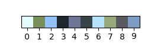 
</div>

The color values (centroids) are calculated by K-Means. Since there are 10 clusters, we can assign each cluster a digit as we want. When we keep colors calculated by K-Means same but change the digit for each color represents, we will have a different seed number and that is totally fine.

We can also change color values proposed by K-Means and design our own palette. This will ofcourse change how the image looks. You can add colors to a grayscale image using this tip.

The last digit may be one of 2,4,5,6,8 and if you don't want to change last pixels color, you can substitute last digits color with any of 1,3,7,9's color and form a new seed number.


## Primality Test

The simplest way to tell whether a number is a prime or not is to try to divide it by all primes starting from 2 up to the square root of the number. This approach is not 
suitable for large numbers, like the ones we are dealing with. There are better ways to test primality with 100% accuracy, but they also take too much time.

To ease the process of testing a large number, we can use a probabilistic method which runs faster but compromises accuracy. [Miller-Rabin](https://en.wikipedia.org/wiki/Miller%E2%80%93Rabin_primality_test) is a probabilistic primality test algorithm which runs in $$O(k\ log^3n)$$ time and has a false positive probability of $$4^{-k}$$. Here, $$k$$ is the number of rounds to be executed in the algorithm.

## Code

A python implementation of generating prime images can be seen at [github.com/cankut/image-to-prime](https://github.com/cankut/image-to-prime), feel free to use it with your own images :)

## Prime Gallery

<table class="gallery">
  <tr>
    <td>Original</td>
    <td>Prime</td>
  </tr>
  <tr>
    <td>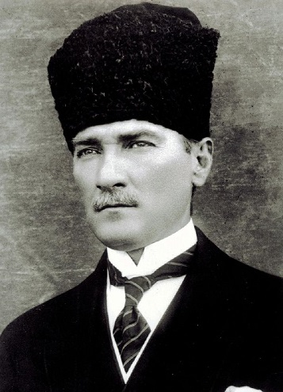</td>
    <td></td>
  </tr>  
  <tr>
  <td colspan="2">Annotated</td>
  </tr>
  <tr>
    <td colspan="2"><div>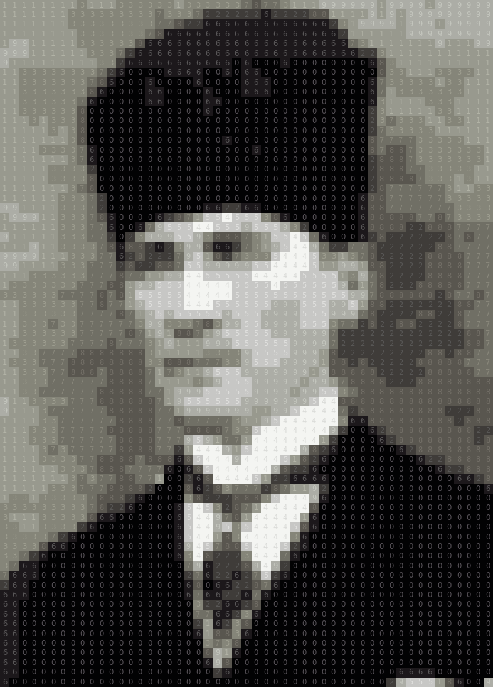</div></td>
  </tr>
</table>

<hr/>

<table class="gallery">
  <tr>
    <td>Original</td>
    <td>Prime</td>
  </tr>
  <tr>
    <td></td>
    <td></td>
  </tr>    
  <tr>
  <td colspan="2">Annotated</td>
  </tr>
  <tr>
    <td colspan="2">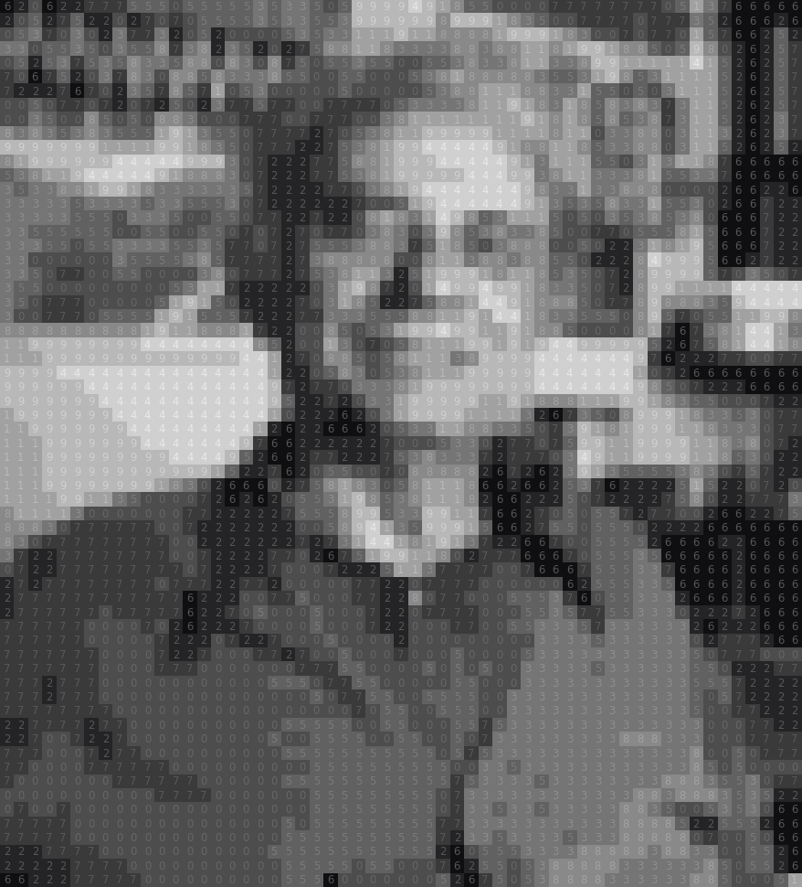</td>
  </tr>
</table>


<hr/>

<table class="gallery">
  <tr>
    <td>Original</td>
    <td>Prime</td>
  </tr>
  <tr>
    <td>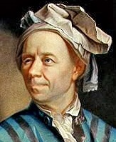</td>
    <td></td>
  </tr>  
   <tr>
  <td colspan="2">Annotated</td>
  </tr>
  <tr>
    <td colspan="2">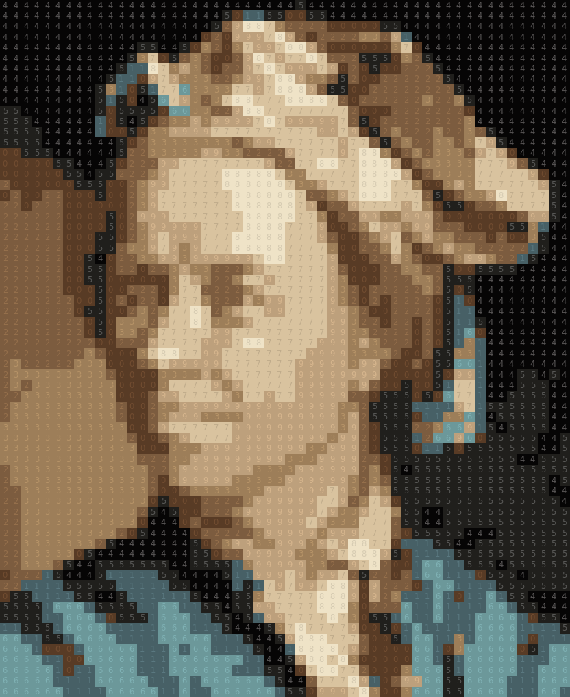</td>
  </tr>  
</table>

<hr/>

<table class="gallery">
  <tr>
    <td>Original</td>
    <td>Prime</td>
  </tr>
  <tr>
    <td></td>
    <td></td>
  </tr>  
   <tr>
  <td colspan="2">Annotated</td>
  </tr>
  <tr>
    <td colspan="2">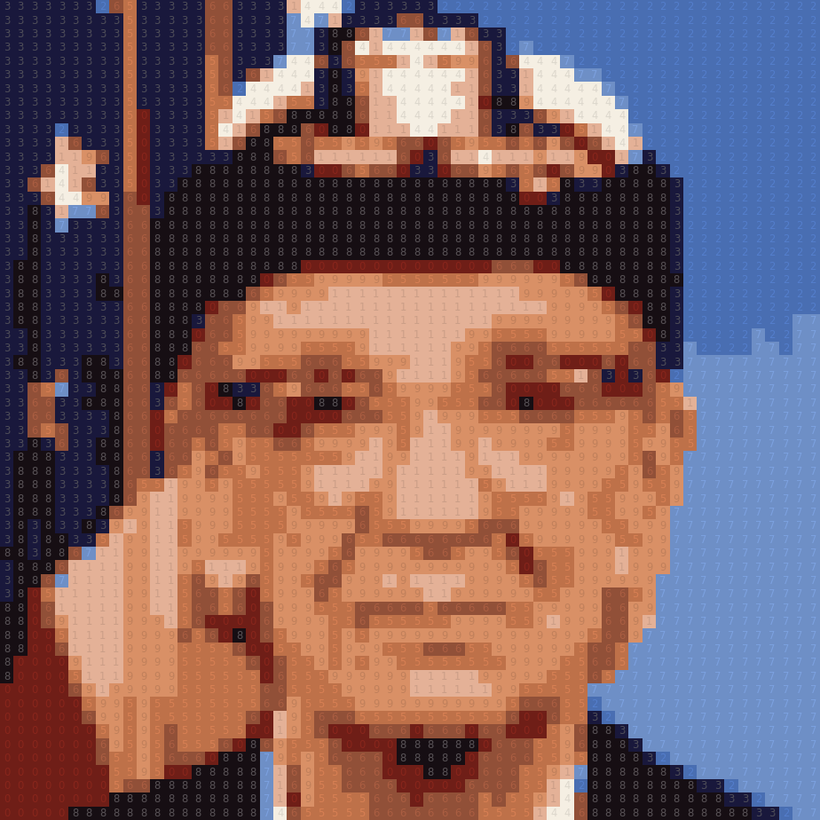</td>
  </tr>     
</table>

<table class="gallery">
  <tr>
    <td>Original</td>
    <td>Prime</td>
  </tr>
  <tr>
    <td></td>
    <td></td>
  </tr>  
   <tr>
  <td colspan="2">Annotated</td>
  </tr>
  <tr>
    <td colspan="2">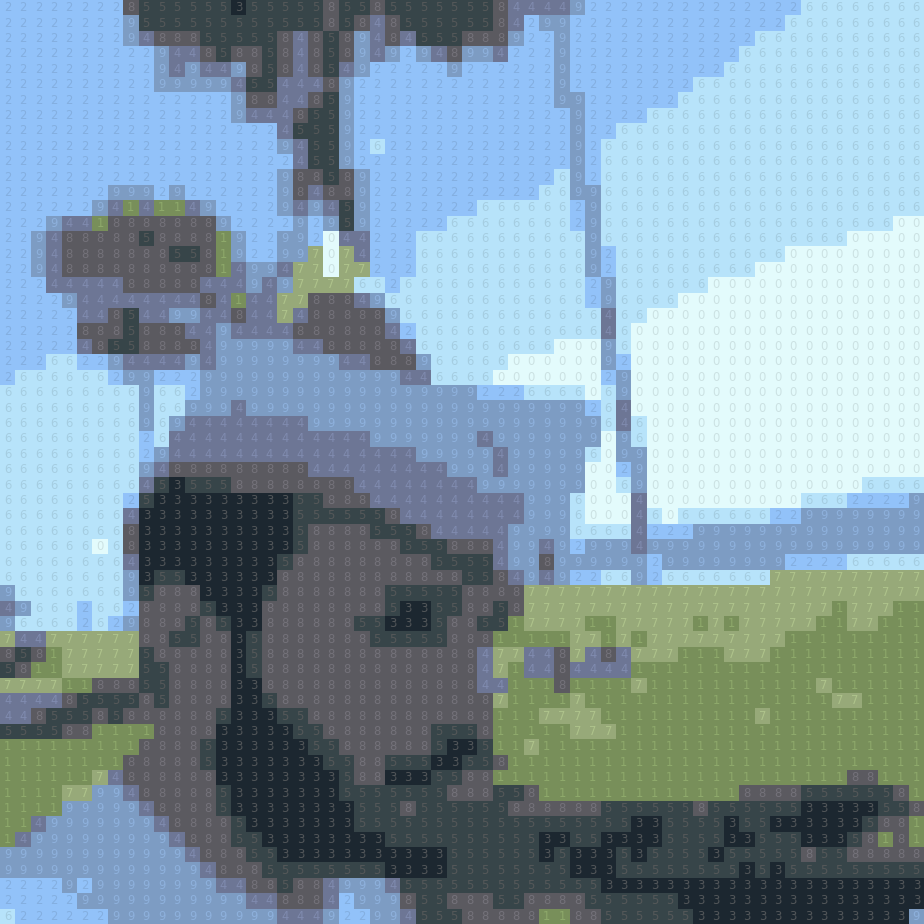</td>
  </tr>     
</table>

